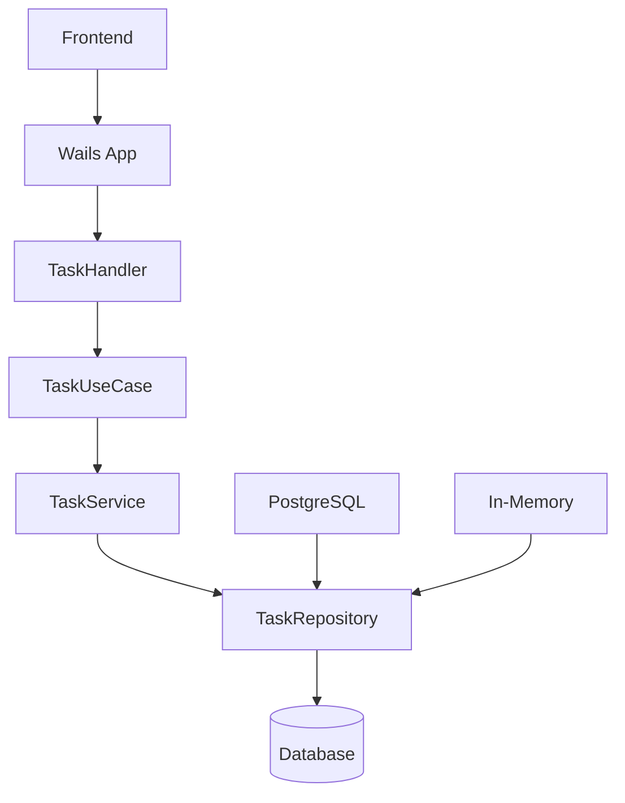

# 🏗️ Архитектура приложения

## Обзор

Todo App построен по принципам Clean Architecture с четким разделением слоев и зависимостей.

## 📁 Структура проекта

```
todo-wails-go/
├── main.go                 # Точка входа приложения
├── app.go                  # Основная логика Wails приложения
├── go.mod                  # Go модули и зависимости
├── wails.json              # Конфигурация Wails
├── internal/               # Внутренние пакеты
│   ├── domain/             # Доменный слой
│   │   ├── models/         # Модели данных
│   │   │   └── task.go     # Модель задачи
│   │   └── ports/          # Интерфейсы (порты)
│   │       ├── repository.go # Интерфейс репозитория
│   │       └── service.go    # Интерфейс сервиса
│   ├── adapter/            # Адаптеры (внешний слой)
│   │   ├── db/             # Репозитории базы данных
│   │   │   ├── postgres.go # PostgreSQL репозиторий
│   │   │   └── memory.go   # In-memory репозиторий
│   │   ├── handler/        # HTTP обработчики
│   │   │   └── task_handler.go
│   │   └── service/        # Бизнес-логика
│   │       └── task_service.go
│   └── usecase/            # Сценарии использования
│       └── task_usecase.go
└── frontend/               # Frontend приложения
    ├── src/
    │   ├── main.js         # Основной JavaScript
    │   ├── style.css       # Стили
    │   └── app.css         # Дополнительные стили
    └── index.html          # HTML шаблон
```

## 🔄 Слои архитектуры

### 1. Domain Layer (Доменный слой)

**Назначение**: Содержит бизнес-логику и модели данных.

#### Models (`internal/domain/models/`)
- `Task` - основная модель задачи
- `CreateTaskRequest` - запрос на создание задачи
- `UpdateTaskRequest` - запрос на обновление задачи
- `FilterOptions` - опции фильтрации и сортировки

#### Ports (`internal/domain/ports/`)
- `TaskRepository` - интерфейс для работы с данными
- `TaskService` - интерфейс для бизнес-логики

### 2. Adapter Layer (Слой адаптеров)

**Назначение**: Реализует интерфейсы доменного слоя.

#### Database Adapters (`internal/adapter/db/`)
- `PostgresRepository` - реализация для PostgreSQL
- `MemoryRepository` - реализация для in-memory хранилища

#### Service Adapters (`internal/adapter/service/`)
- `TaskService` - реализация бизнес-логики

#### Handler Adapters (`internal/adapter/handler/`)
- `TaskHandler` - HTTP обработчики для Wails

### 3. Use Case Layer (Слой сценариев)

**Назначение**: Координирует выполнение бизнес-сценариев.

- `TaskUseCase` - сценарии работы с задачами

## 🔗 Поток данных



## 📊 Модели данных

### Task Model

```go
type Task struct {
    ID          string     `json:"id" db:"id"`
    Title       string     `json:"title" db:"title"`
    Description string     `json:"description" db:"description"`
    Priority    Priority   `json:"priority" db:"priority"`
    Status      Status     `json:"status" db:"status"`
    DueDate     *time.Time `json:"dueDate,omitempty" db:"due_date"`
    CreatedAt   time.Time  `json:"createdAt" db:"created_at"`
    UpdatedAt   time.Time  `json:"updatedAt" db:"updated_at"`
}
```

### Priority Enum

```go
type Priority int

const (
    PriorityLow Priority = iota    // 0
    PriorityMedium                 // 1
    PriorityHigh                   // 2
)
```

### Status Enum

```go
type Status int

const (
    StatusActive Status = iota     // 0
    StatusCompleted                // 1
)
```

## 🗄️ База данных

### PostgreSQL Schema

```sql
CREATE TABLE tasks (
    id VARCHAR(36) PRIMARY KEY,
    title VARCHAR(255) NOT NULL,
    description TEXT,
    priority INTEGER NOT NULL DEFAULT 0,
    status INTEGER NOT NULL DEFAULT 0,
    due_date TIMESTAMP,
    created_at TIMESTAMP NOT NULL DEFAULT NOW(),
    updated_at TIMESTAMP NOT NULL DEFAULT NOW()
);

-- Индексы для производительности
CREATE INDEX idx_tasks_status ON tasks(status);
CREATE INDEX idx_tasks_priority ON tasks(priority);
CREATE INDEX idx_tasks_created_at ON tasks(created_at);
CREATE INDEX idx_tasks_due_date ON tasks(due_date);
```

### In-Memory Storage

- Использует `map[string]*Task` для хранения
- Потокобезопасность через `sync.RWMutex`
- Автоматическое переключение при недоступности PostgreSQL

## 🎨 Frontend Architecture

### Структура

```
frontend/
├── index.html          # Основной HTML
├── src/
│   ├── main.js         # Главный JavaScript файл
│   ├── style.css       # Основные стили
│   └── app.css         # Дополнительные стили
└── wailsjs/            # Автогенерированные биндинги
    └── go/main/App.js  # Go функции для JavaScript
```

### Компоненты

1. **TaskForm** - форма создания/редактирования задач
2. **TaskList** - список задач с фильтрацией
3. **TaskItem** - отдельная задача
4. **Modal** - модальные окна
5. **ThemeToggle** - переключатель темы

### State Management

```javascript
// Глобальное состояние
let tasks = [];                    // Список задач
let currentFilter = {...};         // Текущие фильтры
let editingTask = null;            // Редактируемая задача
let isDarkTheme = false;           // Тема приложения
```

## 🔄 API Design

### Go Functions (Wails Bindings)

```go
// Основные операции
CreateTask(reqJSON string) (string, error)
GetTasks(filterJSON string) (string, error)
UpdateTask(reqJSON string) (string, error)
DeleteTask(id string) error
ToggleTaskStatus(id string) (string, error)

// Фильтрация
GetTasksByStatus(status int) (string, error)
GetTasksByPriority(priority int) (string, error)
GetOverdueTasks() (string, error)
```

### Request/Response Format

```json
// CreateTask Request
{
    "title": "Task title",
    "description": "Task description",
    "priority": 1,
    "dueDate": "2024-01-01T12:00:00Z"
}

// Task Response
{
    "id": "uuid",
    "title": "Task title",
    "description": "Task description",
    "priority": 1,
    "status": 0,
    "dueDate": "2024-01-01T12:00:00Z",
    "createdAt": "2024-01-01T10:00:00Z",
    "updatedAt": "2024-01-01T10:00:00Z"
}
```

## 🎯 Принципы проектирования

### 1. Dependency Inversion
- Высокоуровневые модули не зависят от низкоуровневых
- Оба зависят от абстракций (интерфейсы)

### 2. Single Responsibility
- Каждый класс/функция имеет одну ответственность
- Четкое разделение слоев

### 3. Open/Closed
- Открыт для расширения, закрыт для модификации
- Легко добавить новые репозитории или сервисы

### 4. Interface Segregation
- Клиенты не должны зависеть от интерфейсов, которые не используют
- Маленькие, специализированные интерфейсы

## 🔧 Конфигурация

### Environment Variables

```bash
DATABASE_URL="host=localhost port=5432 user=postgres password=postgres dbname=todo_app sslmode=disable"
```

### Wails Configuration

```json
{
  "name": "todo-wails-go",
  "outputfilename": "todo-wails-go",
  "frontend:install": "npm install",
  "frontend:build": "npm run build",
  "frontend:dev:watcher": "npm run dev"
}
```

## 🚀 Расширение функциональности

### Добавление нового репозитория

1. Создать интерфейс в `domain/ports/`
2. Реализовать в `adapter/db/`
3. Обновить фабрику в `app.go`

### Добавление нового API endpoint

1. Добавить метод в `TaskHandler`
2. Добавить метод в `App` struct
3. Обновить `main.go` для биндинга

### Добавление новой модели

1. Создать в `domain/models/`
2. Обновить миграции базы данных
3. Добавить валидацию в сервисе

## 📈 Производительность

### Оптимизации

1. **Индексы базы данных** - для быстрого поиска
2. **Connection pooling** - для PostgreSQL
3. **Lazy loading** - для больших списков
4. **Debouncing** - для фильтрации
5. **CSS transitions** - для плавных анимаций

### Мониторинг

- Логирование всех операций
- Метрики производительности
- Отслеживание ошибок

## 🔒 Безопасность

### Принципы

1. **Валидация входных данных** - на всех уровнях
2. **SQL injection protection** - параметризованные запросы
3. **XSS protection** - экранирование HTML
4. **Input sanitization** - очистка пользовательского ввода

### Рекомендации

- Использовать HTTPS в продакшене
- Регулярно обновлять зависимости
- Логировать подозрительную активность
- Использовать принцип минимальных привилегий

---

Эта архитектура обеспечивает:
- **Масштабируемость** - легко добавлять новые функции
- **Тестируемость** - каждый слой можно тестировать отдельно
- **Поддерживаемость** - четкое разделение ответственности
- **Гибкость** - легко менять реализации
